# AI-Guided, Closed-Loop Biomarker Discovery Pipeline

> A self-driving discovery system that learns **causal, multi-scale structure** linking **molecular state → multicellular tissue function → clinical outcomes**, and uses that understanding to design the **next experiments**, generate **patient avatars**, and nominate **robust biomarkers**.

**Key principle:** Functional tissue outcomes (barrier integrity, electrophysiology, contractility, transport, perfusion) are enforced as *mesoscale mediators* between omics and clinical endpoints.

---

## Table of Contents
1. [Mission & Outcomes](#mission--outcomes)  
2. [System Architecture](#system-architecture)  
3. [Physical Testbeds](#physical-testbeds)  
4. [Sensing & Assays](#sensing--assays)  
5. [Data Ingestion & Metadata](#data-ingestion--metadata)  
6. [Storage & Data Model](#storage--data-model)  
7. [Knowledge Graph](#knowledge-graph)  
8. [Modeling & Simulation](#modeling--simulation)  
9. [Decision & Orchestration](#decision--orchestration)  
10. [Biomarker Discovery Pipeline](#biomarker-discovery-pipeline)  
11. [Patient Avatars & Personalization](#patient-avatars--personalization)  
12. [Evidence Ladder & Validation](#evidence-ladder--validation)  
13. [Governance & Privacy](#governance--privacy)  
14. [KPIs & Dashboards](#kpis--dashboards)  
15. [Initial 90-Day MVP](#initial-90-day-mvp)  
16. [Repo Layout](#repo-layout)  
17. [Getting Started](#getting-started)  
18. [Glossary](#glossary)

---

## Mission & Outcomes
**Mission.** Discover mechanistic, translatable biomarkers by actively learning causal structure across **molecule → cell state → tissue function → clinical outcome**, using patient-derived, perfused, multicellular in-vitro systems.

**Success Outcomes**
- Biomarkers with **interventional evidence** on tissue function, **replication** across donors and models, and **clinical mediation** in harmonized cohorts.
- **Patient avatars** that forecast functional responses and support **personalized biomarkers** and **donor-specific treatment simulations**.
- A **closed loop** that continuously improves knowledge (and the KG) with every data cycle.

---

## System Architecture
> The Mermaid sources live in `docs/diagrams/` so they can be re-used across docs and exported as PNG/SVG.

- **Architecture (overview):** `docs/diagrams/architecture_overview.mmd`  
- **Decision sequence:** `docs/diagrams/decision_sequence.mmd`  
- **Avatars flow:** `docs/diagrams/avatars_flow.mmd`  
- **Evidence ladder:** `docs/diagrams/evidence_ladder.mmd`



To export images (requires Mermaid CLI):  
```bash
make render-diagrams

Physical Testbeds
	•	Systems: perfused patient-derived organoids, multicellular tubular tissues, vascularized spheroids/organoids; programmable microfluidics; environmental control (O₂, shear, temp, light).
	•	Capabilities: time-sequenced dosing/gradients; sampling ports (media/biopsies); viability guardrails.
	•	Functional outputs: TEER/permeability, electrophysiology (MEA), contractility, calcium/optical physiology, oxygen consumption, perfusion/flow metrics, cilia beat frequency.

⸻

Sensing & Assays
	•	Functional instrumentation; high-content imaging (self-supervised morphology embeddings); sc-multi-omics (scRNA/ATAC/CITE); spatial transcriptomics/proteomics; bulk proteo/phospho/metabolomics; secretome & flux; interventional readouts (perturb-seq, CRISPRi/a).
	•	Orchestration: assay scheduling tied to perturbation scripts; calibration/QC/batch correction; on-the-fly feature extraction.

⸻

Data Ingestion & Metadata
	•	LIMS/ELN for lineage/protocols/telemetry; streaming broker for time-stamped events; experiment versioning; standardized ontologies (donor/consent, assay, device, perturbation, units); automated QC and batch correction with audit trails.

⸻

Storage & Data Model
	•	Lakehouse tiers: raw → bronze (parsed) → silver (QC’d) → gold (analysis-ready).
	•	Typed multi-scale Knowledge Graph (KG); feature store & embedding hub (morphology, cell-state, graph embeddings, twin parameters).
	•	Patient context: epigenetics/lifestyle/exposome; Clinical/RWD via OMOP; federated learning connectors (no raw PHI egress); consent & governance.

⸻

Knowledge Graph

The spine of the platform: a typed, versioned graph that contains priors from open sources and accumulating, provenance-linked evidence from our analyses.
	•	Entities: donor/patient, sample, cell type/state, ligand–receptor pair, pathway/module, gene/protein/variant, perturbation, device, assay, tissue function, environment (flow/O₂), clinical outcome, medication/exposure.
	•	Relations: causal (interventional support), temporal, co-expression/module membership, cell–cell communication, spatial neighborhood, clinical association, provenance.
	•	Evidence: prior score, posterior updates, uncertainty, direction/sign, cell/tissue context, condition tags, source/license, versioning.

Roles in the pipeline
	•	Prior & constraint for modeling (regularizes causal search and module discovery).
	•	Mechanistic scaffold & parameter priors for digital twins.
	•	Decision surface for active learning (identify high-value uncertainty).
	•	Ledger for biomarker evidence and mediation paths.

⸻

Modeling & Simulation
	•	Representation learning: multimodal contrastive/self-supervised across imaging, function, omics.
	•	Module discovery: WGCNA/hdWGCNA-style modules with KG-derived annotations (cell/neighborhood/pathway).
	•	Causal/dynamic modeling: time-series + interventional graphs; mediation enforcing molecular → function → clinical.
	•	Hybrid mechanistic–ML digital twins: ODE/QSP modules + PBPK/transport; ML surrogates for complex subsystems; donor-conditioned parameters; Bayesian uncertainty; counterfactual simulation.

⸻

Decision & Orchestration
	•	Active learning/Bayesian optimization: choose perturbations (dose/order/timing) that maximize expected causal information and reduce uncertainty.
	•	Model predictive control (MPC): enforce viability/safety constraints while exploring.
	•	Scheduler: resource-aware execution across devices/assays with replication and counterbalancing.

⸻

Biomarker Discovery Pipeline
	•	Use cases: diagnostic, prognostic, predictive, monitoring, PD markers.
	•	Scoring: causal impact on functional mediators; cross-model/donor replication; clinical association/mediation; assayability; robustness.
	•	Evidence dossier: mechanism path (graph), interventional evidence, replication, clinical mediation, analytical validation, risk/uncertainty, next steps.

⸻

Patient Avatars & Personalization

A donor-specific hybrid twin calibrated to that donor’s functional and omic trajectories; outputs personalized predictions and unique markers with path-level attribution.

⸻

Evidence Ladder & Validation
	•	E0: Correlation only
	•	E1: Temporal precedence + module linkage
	•	E2: Interventional causality in vitro
	•	E3: Cross-model & cross-donor replication
	•	E4: Clinical association + mediation via function
	•	E5: Prospective predictive performance + analytical validation
	•	Analytical validation: LoD/LoQ, linearity, precision, robustness.
	•	Biological validation: orthogonal assays, rescue experiments, donor hold-outs.
	•	Transportability: explicit checks from in-vitro to clinical domain.

⸻

Governance & Privacy
	•	Consent tracking; provenance & audit; PHI minimization; federated training for multi-site learning; license-aware KG edges; version pinning (KG vX.Y, pipelines vA.B, dataset releases).

⸻

KPIs & Dashboards
	•	Discovery velocity (cycles/week, info gain/experiment)
	•	Causal clarity (fraction of edges with interventional support; mediation effect sizes)
	•	Robustness (cross-donor/model replication)
	•	Translatability (AUROC/PPV on clinical endpoints)
	•	Operations (assay pass rate; cost per E3/E4 candidate)

⸻

Initial 90-Day MVP
	•	Scope: 1 disease area; 2 model systems (e.g., perfused organoid + tubular tissue).
	•	Assays: functional + imaging + targeted scRNA + secretome.
	•	Modeling: single mediation path; one digital-twin module (transport + simple signaling); basic active learner.
	•	Clinical link: one OMOP site, retrospective mediation.
	•	Output: 5–10 ranked candidates at E2–E3 with dossiers + a working avatar for ≥3 donors.

⸻

Repo Layout

Auto-generated by scripts/update_repo_tree.py. Re-run make update-readme-tree after adding folders/files.
<!-- TREE:START -->
```
ai-pipeline/
   └─ Makefile
   └─ README.md
  └─ tools/
    └─ cli/
       └─ main.py
  └─ biomarkers/
    └─ dossiers/
    └─ scoring/
  └─ docs/
    └─ diagrams/
       └─ architecture_overview.mmd
       └─ data_flow_demo.mmd
       └─ decision_sequence.mmd
       └─ demo_gantt.mmd
       └─ evidence_ladder.mmd
      └─ exports/
         └─ architecture_overview.png
         └─ architecture_overview.svg
         └─ data_flow_demo.png
         └─ data_flow_demo.svg
         └─ decision_sequence.png
         └─ decision_sequence.svg
         └─ demo_gantt.png
         └─ demo_gantt.svg
         └─ evidence_ladder.png
         └─ evidence_ladder.svg
  └─ modeling/
    └─ twins/
    └─ predictors/
    └─ modules/
    └─ uncertainty/
  └─ env/
     └─ requirements.txt
  └─ assays/
    └─ protocols/
    └─ qc/
  └─ dashboards/
    └─ notebooks/
  └─ scripts/
     └─ render_diagrams_make.sh
     └─ render_mermaid.sh
     └─ update_repo_tree.py
  └─ kg/
    └─ releases/
    └─ etl/
    └─ schema/
  └─ decision/
    └─ active_learning/
    └─ mpc_scheduler/
  └─ data/
    └─ lakehouse/
  └─ demos/
     └─ AKI_OPEN_DATA_DEMO.md
```
<!-- TREE:END -->

Getting Started
	1.	Clone & environment
  python -m venv .venv && source .venv/bin/activate
  pip install -r env/requirements.txt

  2.	Mermaid exports (optional)
  npm install -g @mermaid-js/mermaid-cli
  make render-diagrams

  3.	Open-data demo
	•	See demos/AKI_OPEN_DATA_DEMO.md for commands, data pointers, and acceptance criteria.

Glossary
	•	Functional mediator — tissue-level readout (e.g., TEER, MEA) enforced as the bridge from molecular state to clinical outcome.
	•	Digital twin (avatar) — donor-specific hybrid mechanistic–ML model calibrated to that donor’s functional/omic trajectories.
	•	Evidence ladder — progression from correlation → interventional causality → clinical mediation → prospective validation.
	•	KG — typed, versioned graph encoding biology, context, priors, and live evidence with uncertainty and provenance.