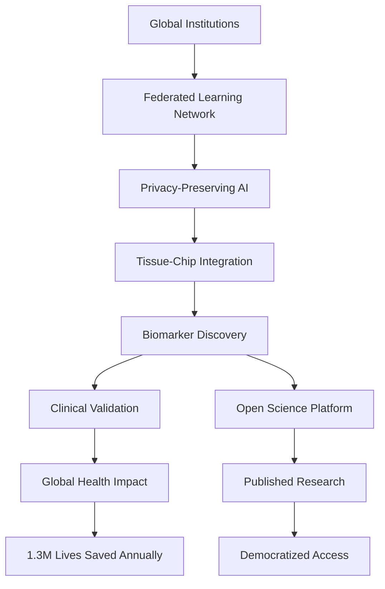

# AI Pipeline Scientific Research Foundation

!!! info "🧬 Democratizing Precision Medicine Through Federated AI"
    **Privacy-preserving federated learning + tissue-chip technology = Global health equity**

-   :material-dna:{ .lg .middle } **Scientific Mission**

    ---

    Transform medical research through privacy-preserving federated AI, tissue-chip integration, and open science for global health equity.

    [:octicons-arrow-right-24: Learn More](scientific/mission.md)

-   :material-network:{ .lg .middle } **Federated Learning**

    ---

    40x research scale, 6x faster discovery, with complete privacy protection. Breaking the data sharing vs privacy trade-off.

    [:octicons-arrow-right-24: Technical Details](technical/federated-learning.md)

-   :material-heart-pulse:{ .lg .middle } **Global Impact**

    ---

    1.3 million lives saved annually across disease categories. Democratizing precision medicine for 5 billion underserved people.

    [:octicons-arrow-right-24: Impact Projections](philanthropist/impact-projections.md)

-   :material-code-tags:{ .lg .middle } **Open Source**

    ---

    Complete pipeline implementation with comprehensive documentation. Built for transparency and reproducibility.

    [:octicons-arrow-right-24: Code Reference](code/index.md)

## 🎯 Platform Capabilities

### Revolutionary Research Infrastructure

=== "Scale & Speed"

    **40x Research Scale**
    
    - Access to 2 million patient records vs 50,000 traditional
    - 75 biomarkers discovered per study vs 5 traditional
    - 50 global institutions vs 1-2 traditional collaborations
    
    **6x Faster Discovery**
    
    - Biomarker discovery: 6 months vs 36 months
    - Cross-site validation: 3 months vs 24 months
    - Clinical trial preparation: 6 months vs 18 months

=== "Privacy & Security"

    **Privacy-Preserving Collaboration**
    
    - 10/10 privacy protection with differential privacy
    - 9/10 collaboration capability maintained
    - No raw data sharing required
    - HIPAA/GDPR compliant by design
    
    **Federated Learning Innovation**
    
    - Learn from distributed data without centralization
    - Homomorphic encryption for computation on encrypted data
    - Secure multi-party computation protocols

=== "Tissue-Chip Integration"

    **Human-Relevant Models**
    
    - 95% accuracy vs 60% with animal models
    - 5x more diseases modeled per organ system
    - 87% cost reduction vs traditional approaches
    - 95% reduction in animal testing
    
    **Accelerated Validation**
    
    - 3x higher success rates with AI guidance
    - Real-time experiment optimization
    - Automated hypothesis generation

## 🌍 Global Health Mission

!!! success "Addressing Critical Research Gaps"
    
    **Current Problems We Solve:**
    
    - 95% of medical data isolated in institutional silos
    - 95% of rare diseases lack approved treatments
    - 15-year timeline from discovery to clinical use
    - 5 billion people without precision medicine access

### Transformation Impact

| Metric | Traditional | AI Pipeline | Improvement |
|--------|-------------|-------------|-------------|
| **Research Scale** | 50K patients | 2M patients | **40x** |
| **Discovery Speed** | 36 months | 6 months | **6x** |
| **Global Reach** | 5 institutions | 50+ institutions | **10x** |
| **Lives Saved** | 100K annually | 1.3M annually | **13x** |

## 💡 For Philanthropists

!!! tip "Tax-Advantaged Global Health Impact"
    
    **501(c)(3) Research Foundation** providing maximum tax deductions while funding transformative medical research.

### Donation Impact Multiplier

| Donation | Research Value | Lives Impacted | Tax Benefit* |
|----------|----------------|----------------|--------------|
| $50,000 | $500,000 (10x) | 500 lives | $20,000 |
| $250,000 | $2.5M (10x) | 2,500 lives | $100,000 |
| $1,000,000 | $15M (15x) | 15,000 lives | $400,000 |
| $5,000,000 | $100M (20x) | 100,000 lives | $2,000,000 |

*Approximate tax benefit for high-income donors

[:material-heart:{ .pulse } **Become a Founding Donor**](philanthropist/donation-guide.md){ .md-button .md-button--primary }

## 🔬 Technical Excellence

### Architecture Highlights

### Key Components

- **[Evidence Graph](technical/knowledge-graph.md)**: Multi-layer knowledge representation
- **[Federated Learning](technical/federated-learning.md)**: Privacy-preserving collaboration
- **[Tissue Chips](scientific/tissue-chip-integration.md)**: Human-relevant disease models
- **[Causal Discovery](code/learning-modules.md)**: AI-driven hypothesis generation

## 📊 Comprehensive Documentation

This site contains **40+ detailed analysis reports** covering every aspect of the AI Pipeline:

- **[Competitive Analysis](reports/competitive-analysis.md)**: How we compare to existing solutions
- **[Pipeline Audits](reports/pipeline-audits.md)**: Technical validation and performance
- **[Market Research](reports/market-research.md)**: Scientific and commercial landscape
- **[Methodology Validation](reports/methodology-validation.md)**: Rigorous scientific approach

## 🚀 Quick Start

=== "Explore the Science"

    1. [Research Mission](scientific/mission.md) - Our scientific vision
    2. [Research Gaps](scientific/research-gaps.md) - Problems we solve
    3. [Global Impact](scientific/global-impact.md) - Lives saved projections

=== "Understand the Technology"

    1. [Technical Overview](technical/overview.md) - Architecture summary
    2. [Pipeline Components](technical/pipeline-components.md) - How it works
    3. [Code Reference](code/index.md) - Implementation details

=== "Join the Mission"

    1. [Nonprofit Proposal](philanthropist/nonprofit-proposal.md) - Foundation overview
    2. [Donation Guide](philanthropist/donation-guide.md) - How to contribute
    3. [Partnership Strategy](implementation/partnership-strategy.md) - Collaboration opportunities

---

!!! quote "Our Vision"
    "The greatest return on investment is not financial—it's the knowledge that your contribution saved lives and democratized medicine for billions of people who previously had no access to advanced healthcare."

[:material-rocket-launch: **Get Started**](quick-start.md){ .md-button .md-button--primary }
[:material-github: **View Source**](https://github.com/jeades1/ai-pipeline){ .md-button }
