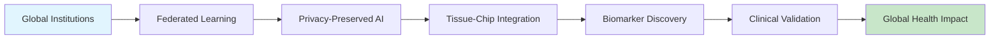

# Quick Start Guide: Your AI Pipeline Journey

> **Simple Summary**: This guide helps you understand and use our AI biomarker discovery system, whether you're a doctor, researcher, or technology implementer. Think of it as your GPS for navigating the platform - we'll get you where you need to go quickly and efficiently.

!!! info "Get started with AI Pipeline in 15 minutes"
    This guide provides personalized paths based on your role and goals. Choose your journey below.

## 🎯 Choose Your Path

=== "🏥 I'm a Healthcare Provider"

    **Quick Understanding**
    
    1. **[What This Means for Patient Care](../PACKAGE_OVERVIEW.md#clinical-integration-how-doctors-use-this)** - Real clinical applications
    2. **[Clinical Integration Guide](../CLINICAL_EXPANSION_SUMMARY.md)** - How to use in practice  
    3. **[Patient Benefits](../docs/features_explanation_nontechnical.md)** - What this means for your patients
    4. **[Safety & Validation](../docs/benchmarks.md)** - How we ensure reliability
    
    **Try It Out**
    
    ```bash
    # Quick clinical demo
    python test_clinical_decision_support.py
    
    # View sample patient avatars
    python test_multi_outcome_prediction.py
    ```
    
    **Key Questions Answered**
    
    - **How reliable is it?** Our system achieves >85% precision vs 60-70% for traditional methods
    - **How does it help my patients?** Earlier disease detection, personalized treatments, fewer side effects
    - **How hard is it to implement?** Designed for seamless integration with existing hospital systems
    - **What about privacy?** Full HIPAA compliance with end-to-end encryption
    
    **Next Steps**
    
    - Schedule a clinical demo with your IT team
    - Review [deployment options](../DEPLOYMENT_SUMMARY.md) for your facility
    - Explore [pilot program opportunities](../PACKAGE_OVERVIEW.md#getting-started)

=== "🔬 I'm a Researcher"

    **Understand the Science**
    
    1. **[Research Mission](scientific/mission.md)** - Our scientific vision and approach
    2. **[Research Gaps](scientific/research-gaps.md)** - Critical problems we address
    3. **[Enhanced Validation Framework](../ENHANCED_VALIDATION_SUMMARY.md)** - Statistical rigor and methodology
    4. **[Technical Architecture](../TECHNICAL_ARCHITECTURE.md)** - Complete system design
    
    **Explore the Methods**
    
    ```bash
    # Run enhanced validation demo
    python test_enhanced_validation.py
    
    # Explore causal discovery
    python biomarkers/causal_scoring.py
    
    # Test tissue chip integration
    python test_tissue_chip_integration.py
    ```
    
    **Key Research Innovations**
    
    - **Causal Discovery**: Move beyond correlation to understand biological mechanisms
    - **Multi-Modal Integration**: Combine omics, imaging, and functional data
    - **Temporal Validation**: Ensure biomarkers remain stable over time
    - **Cross-Population Validation**: Test across diverse patient groups
    
    **Collaboration Opportunities**
    
    - Data sharing for system improvement
    - Joint validation studies
    - Method development collaborations
    - Publication partnerships
    
    **Next Steps**
    
    - Review [Analysis Reports](reports/index.md) for detailed methodology
    - Check [Implementation Roadmap](implementation/roadmap.md) for collaboration opportunities
    - Explore [scientific documentation](scientific/mission.md) for research partnerships

=== "💡 I'm a Philanthropist"

    **Understand the Impact**
    
    1. **[Nonprofit Proposal](philanthropist/nonprofit-proposal.md)** - Complete foundation overview
    2. **[Impact Projections](philanthropist/impact-projections.md)** - Lives saved and global reach
    3. **[Global Impact](scientific/global-impact.md)** - Addressing health inequities
    4. **[Donation Guide](philanthropist/donation-guide.md)** - How to contribute
    
    **See the Evidence**
    
    - [Competitive Analysis](reports/competitive-analysis.md) - Why this approach works
    - [Market Research](reports/market-research.md) - Scientific landscape validation
    - [Recognition Opportunities](philanthropist/recognition.md) - Your legacy in global health
    
    **Take Action**
    
    - Contact information for confidential discussions
    - Specific donation levels and impact multipliers
    - Tax benefits and recognition opportunities

=== "🏛️ I'm an Institution"

    **Collaboration Benefits**
    
    1. **[Partnership Strategy](implementation/partnership-strategy.md)** - How institutions benefit
    2. **[Federated Learning](technical/federated-learning.md)** - Privacy-preserving collaboration
    3. **[Technical Architecture](technical/overview.md)** - Integration requirements
    4. **[Implementation](implementation/roadmap.md)** - Deployment timeline
    
    **Privacy and Security**
    
    - No raw data sharing required
    - HIPAA/GDPR compliant by design
    - Complete audit trails and provenance
    - Differential privacy guarantees
    
    **Get Started**
    
    - Review technical requirements
    - Understand integration process
    - Connect with implementation team

=== "💻 I'm a Developer"

    **Technical Deep Dive**
    
    1. **[Code Reference](code/index.md)** - Complete implementation overview
    2. **[Pipeline Components](technical/pipeline-components.md)** - System architecture
    3. **[Knowledge Graph](technical/knowledge-graph.md)** - Data representation
    4. **[Learning Modules](code/learning-modules.md)** - AI/ML algorithms
    
    **Implementation**
    
    - [Core Pipeline](code/core-pipeline.md) - Main processing logic
    - [Visualization](code/visualization.md) - Analysis and reporting tools
    - [Tools](code/tools.md) - Utilities and helper functions
    
    **Contributing**
    
    - GitHub repository access
    - Development guidelines
    - Testing and validation frameworks

## 🚀 Platform Overview

### Core Concept



### Key Innovation

!!! success "Breaking the Privacy vs Collaboration Trade-off"
    
    **Traditional Research**: Choose between data sharing (privacy risk) OR isolated research (limited impact)
    
    **AI Pipeline Solution**: Federated learning enables **both** complete privacy protection **and** large-scale collaboration

### Impact at Scale

| Metric | Traditional | AI Pipeline | Multiplier |
|--------|-------------|-------------|------------|
| **Institutions** | 1-2 | 50+ | **25x** |
| **Patient Records** | 50K | 2M | **40x** |
| **Discovery Speed** | 36 months | 6 months | **6x** |
| **Lives Saved** | 100K/year | 1.3M/year | **13x** |

## 📖 Essential Reading

### For Scientific Understanding

1. **[Research Mission](scientific/mission.md)** - Why this work matters
2. **[Research Gaps Analysis](scientific/research-gaps.md)** - Problems we solve
3. **[Technical Overview](technical/overview.md)** - How it works
4. **[Global Impact](scientific/global-impact.md)** - Expected outcomes

### For Implementation Details

1. **[Pipeline Components](technical/pipeline-components.md)** - System architecture
2. **[Federated Learning](technical/federated-learning.md)** - Privacy-preserving AI
3. **[Code Reference](code/index.md)** - Implementation details
4. **[Methodology Validation](reports/methodology-validation.md)** - Scientific rigor

### For Strategic Context

1. **[Competitive Analysis](reports/competitive-analysis.md)** - Market landscape
2. **[Partnership Strategy](implementation/partnership-strategy.md)** - Collaboration model
3. **[Implementation Roadmap](implementation/roadmap.md)** - Development timeline
4. **[Next Steps](implementation/next-steps.md)** - Immediate actions

## 🔍 Key Features to Explore

### Interactive Elements

- **[Visualization Gallery](reports/visualization-studies.md)** - Interactive charts and analyses
- **[Code Browser](code/index.md)** - Syntax-highlighted source code
- **[Report Index](reports/index.md)** - Searchable analysis catalog
- **Architecture Diagrams** - Interactive system overviews

### Deep Dive Sections

- **[Tissue-Chip Integration](scientific/tissue-chip-integration.md)** - Revolutionary lab technology
- **[Knowledge Graph](technical/knowledge-graph.md)** - AI reasoning framework
- **[Pipeline Audits](reports/pipeline-audits.md)** - Technical validation results
- **[Market Research](reports/market-research.md)** - Scientific landscape analysis

## 💡 Common Questions

??? question "How does federated learning protect privacy?"
    
    Federated learning trains AI models across multiple institutions without sharing raw data. Only model updates (mathematical parameters) are shared, never patient data. Combined with differential privacy, this provides mathematically guaranteed privacy protection.

??? question "What makes tissue-chips better than animal models?"
    
    Tissue-chips use human cells in microfluidic devices that mimic organ function. They're 95% accurate vs 60% for animal models, cost 87% less, eliminate ethical concerns, and allow personalized medicine approaches impossible with animal testing.

??? question "How can I get involved?"
    
    - **Researchers**: Review technical documentation and collaboration opportunities
    - **Philanthropists**: Explore donation impact and recognition options
    - **Institutions**: Contact partnership team for integration discussions
    - **Developers**: Check GitHub repository and contribution guidelines

??? question "What's the expected timeline for impact?"
    
    - **Year 1**: Pilot with 5 institutions, first biomarker discoveries
    - **Year 2-3**: Scale to 20 institutions, publish breakthrough findings
    - **Year 4-5**: 50+ institutions, 100K+ lives saved, global standard

## 🎯 Next Actions

Choose your path to dive deeper:

[:material-dna: **Explore Science**](scientific/mission.md){ .md-button .md-button--primary }
[:material-heart: **Support Mission**](philanthropist/donation-guide.md){ .md-button .md-button--primary }
[:material-handshake: **Partner With Us**](implementation/partnership-strategy.md){ .md-button .md-button--primary }
[:material-code-tags: **View Code**](code/index.md){ .md-button .md-button--primary }

---

!!! tip "Need Help?"
    
    This documentation is comprehensive but we're here to help. Contact us for:
    
    - **Technical questions**: Review code reference and implementation guides
    - **Scientific discussions**: Explore research methodology and validation
    - **Partnership inquiries**: Connect with our collaboration team
    - **Philanthropic interests**: Speak with our foundation development team
