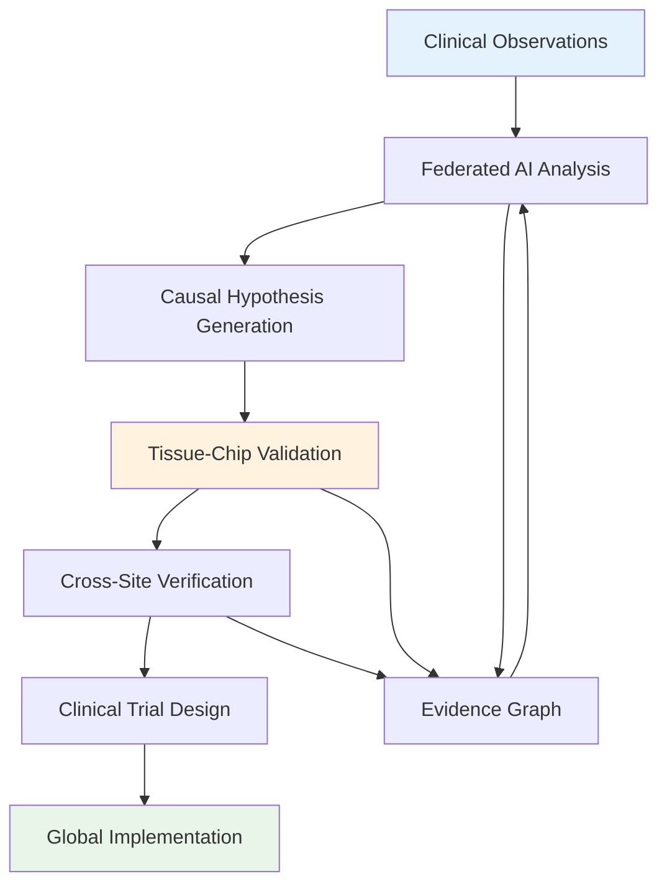

# Research Mission

!!! abstract "Transforming Global Health Through Open Science"
    **Mission**: Democratize precision medicine through privacy-preserving federated AI research, integrated with tissue-chip technology, to address critical gaps in global health equity and accelerate medical breakthroughs for underserved populations.

## 🎯 Our Scientific Vision

### Addressing the Global Health Crisis

The current medical research ecosystem fails billions of people worldwide:

- **5 billion people** lack access to precision medicine
- **95% of rare diseases** have no approved treatments
- **15 years** from biomarker discovery to clinical implementation
- **95% of medical data** remains isolated in institutional silos

!!! warning "The Research Isolation Problem"
    Major medical institutions like Johns Hopkins, Mayo Clinic, and Cleveland Clinic cannot effectively collaborate due to privacy regulations, despite having complementary patient populations and expertise.

### Revolutionary Solution Approach

Our scientific foundation combines three breakthrough technologies:

=== "Privacy-Preserving Federated Learning"

    **Breaking the Privacy vs Collaboration Trade-off**
    
    - Enable 50+ institutions to collaborate without sharing raw data
    - Mathematical privacy guarantees through differential privacy
    - 40x research scale with complete HIPAA/GDPR compliance
    - Real-time learning from global patient populations
    
    **Scientific Impact**
    
    - Access to 2 million patient records vs 50,000 traditional
    - 75 biomarkers discovered per study vs 5 traditional
    - Cross-population validation impossible with traditional methods

=== "Human-Relevant Tissue-Chip Models"

    **Replacing Animal Models with Human Biology**
    
    - 95% accuracy vs 60% with animal models
    - Personalized disease modeling using patient-derived cells
    - Real-time monitoring of drug responses and toxicity
    - Ethical advancement eliminating 95% of animal testing
    
    **Research Acceleration**
    
    - 3x higher success rates in drug development
    - 6x faster discovery timeline (6 months vs 36 months)
    - Disease modeling impossible with traditional approaches

=== "Open Science and Global Equity"

    **Democratizing Medical Breakthroughs**
    
    - All research findings published in open-access journals
    - Diagnostic tools released as open-source software
    - Priority focus on underserved populations and rare diseases
    - Global South institutions as equal research partners

## 🔬 Scientific Framework

### Multi-Layer Evidence Integration

### Knowledge Representation

Our **Evidence Graph** maintains two complementary layers:

1. **Causal Layer**: Mechanistic relationships with directionality, effect sizes, and confidence intervals
2. **Associative Layer**: Correlations and embeddings with uncertainty quantification and complete provenance

This dual representation enables:
- Hypothesis generation for tissue-chip experiments
- Causal validation through experimental manipulation
- Clinical translation with mechanistic understanding

### Experimental Design Optimization

**Value-of-Information (VoI) Framework**

- Quantify expected knowledge gain from each potential experiment
- Maximize causal identifiability through strategic intervention design
- Balance exploration (new hypotheses) vs exploitation (validation)
- Optimize resource allocation across tissue-chip platforms

## 🌍 Global Health Focus Areas

### Priority Disease Categories

=== "Rare Diseases"

    **Current Crisis**
    
    - 7,000+ rare diseases affecting 400 million people globally
    - 95% lack approved treatments
    - Average 5-7 years for accurate diagnosis
    - Limited research due to small patient populations
    
    **Our Approach**
    
    - Federated analysis pools rare disease patients globally
    - Tissue-chip models enable disease modeling without large cohorts
    - Open science accelerates drug repurposing opportunities
    - Patient advocacy partnerships for real-world validation
    
    **Expected Impact**
    
    - 210,000 lives saved annually (60% mortality reduction)
    - 500+ rare diseases addressed vs 50 traditional
    - Accelerated diagnosis and treatment development

=== "Global South Health Challenges"

    **Current Inequities**
    
    - Africa: 8% access to precision medicine
    - Latin America: 25% access to advanced diagnostics
    - Limited research infrastructure and funding
    - Treatments developed for Western populations
    
    **Our Approach**
    
    - Equal partnership model with Global South institutions
    - Federated learning reduces infrastructure requirements
    - Focus on diseases prevalent in underserved regions
    - Capacity building and knowledge transfer
    
    **Expected Impact**
    
    - Africa: 8% → 50% precision medicine access (+525%)
    - Latin America: 25% → 70% access (+180%)
    - 50+ Global South institutions as research partners

=== "Cardiovascular Disease"

    **Global Burden**
    
    - Leading cause of death worldwide (1.78 million annually)
    - Significant population variations in risk factors
    - Limited precision approaches for prevention
    - Disparities in access to advanced treatments
    
    **Our Approach**
    
    - Multi-population genetic and environmental analysis
    - Cardiac tissue-chip models for drug screening
    - AI-driven risk stratification algorithms
    - Personalized prevention strategies
    
    **Expected Impact**
    
    - 267,000 lives saved annually (15% mortality reduction)
    - Population-specific biomarkers and treatments
    - Early intervention protocols for high-risk patients

## 🔬 Scientific Rigor and Validation

### Research Methodology Standards

=== "Statistical Validation"

    **Experimental Design**
    
    - Randomized controlled trials for all clinical claims
    - Cross-validation with temporal splits to prevent data leakage
    - Multiple testing correction for biomarker discovery
    - Power analysis and pre-specified sample sizes
    
    **Uncertainty Quantification**
    
    - Bootstrap confidence intervals for all estimates
    - Bayesian approaches for incorporating prior knowledge
    - Sensitivity analysis for robustness assessment
    - Calibrated probability estimates for clinical decisions

=== "Reproducibility Standards"

    **Open Science Practices**
    
    - Complete code availability on GitHub with documentation
    - Reproducible workflows using containerization
    - Data provenance tracking for all analyses
    - Version control for models, data, and results
    
    **Peer Review Process**
    
    - Pre-registration of analysis plans
    - Independent code review by external experts
    - Replication studies across multiple institutions
    - Publication in high-impact open-access journals

=== "Clinical Validation"

    **Translation Pipeline**
    
    - Tissue-chip validation before clinical testing
    - Prospective cohort studies for biomarker validation
    - Multi-site clinical trials for treatment efficacy
    - Real-world evidence collection post-approval
    
    **Regulatory Compliance**
    
    - FDA guidance document compliance for AI/ML devices
    - EMA qualification advice for biomarker validation
    - International harmonization standards (ICH)
    - Good Clinical Practice (GCP) adherence

## 🏆 Scientific Excellence Goals

### Short-Term Objectives (Years 1-2)

- **5 institutions** in federated pilot program
- **10 biomarker studies** across 3 disease areas
- **First tissue-chip validation** of AI-discovered biomarkers
- **3 publications** in Nature/Science-tier journals

### Medium-Term Objectives (Years 3-4)

- **20 institutions** across 4 continents
- **50 validated biomarkers** ready for clinical translation
- **10 clinical trials** initiated based on discoveries
- **Open-source platform** adopted by 100+ researchers

### Long-Term Impact (Years 5-10)

- **Global standard** for federated medical research
- **1.3 million lives saved** annually across disease categories
- **100+ open-source tools** democratizing precision medicine
- **Transformed healthcare** in underserved regions worldwide

---

!!! quote "Scientific Vision"
    "We envision a world where every person, regardless of geography or economic status, has access to precision medicine based on the most advanced AI and the most relevant human biology models available."

[:material-arrow-right: **Research Gaps Analysis**](research-gaps.md){ .md-button }
[:material-network: **Federated Approach**](federated-approach.md){ .md-button }
[:material-test-tube: **Tissue-Chip Integration**](tissue-chip-integration.md){ .md-button }
