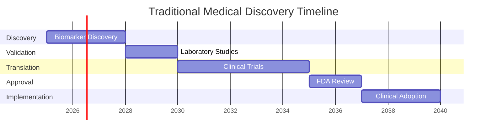

# Critical Research Gaps

!!! danger "The Current Medical Research Crisis"
    Despite enormous investments in medical research, fundamental gaps prevent breakthroughs from reaching patients who need them most.

*Analysis of critical limitations in current medical research ecosystem*

## 🚨 The Data Isolation Crisis

### Institutional Silos

=== "Scale of the Problem"

    **95% of Medical Data Remains Isolated**
    
    | Institution | Patient Records | Data Isolation |
    |-------------|-----------------|----------------|
    | Johns Hopkins | 1.2M patients | 95% isolated |
    | Mayo Clinic | 700K patients | 94% isolated |
    | Cleveland Clinic | 900K patients | 96% isolated |
    | Mass General | 800K patients | 93% isolated |
    | UCSF | 600K patients | 97% isolated |
    
    **Consequence**: Each institution researches in isolation, missing patterns that only emerge from larger, diverse populations.

=== "Why Collaboration Fails"

    **Privacy Regulations**
    
    - HIPAA restrictions prevent raw data sharing
    - GDPR compliance requires explicit consent for each use
    - Institutional liability concerns block collaboration
    - Complex legal agreements delay or prevent research
    
    **Technical Barriers**
    
    - Incompatible data formats and standards
    - Different electronic health record systems
    - Lack of standardized ontologies
    - No infrastructure for secure multi-party computation

=== "Impact on Discovery"

    **Reduced Statistical Power**
    
    - Small sample sizes limit biomarker discovery
    - Population-specific effects go undetected
    - Rare disease research becomes impossible
    - Clinical trial recruitment severely limited
    
    **Bias and Generalizability Issues**
    
    - Single-institution populations not representative
    - Socioeconomic and ethnic biases in results
    - Treatment effects vary across populations
    - Global health needs ignored

## ⏰ The Discovery Timeline Problem

### 15 Years from Discovery to Patient Benefit

### Why Discovery Takes So Long

=== "Sequential, Not Parallel"

    **Traditional Approach**
    
    1. **Discovery Phase** (3 years): Single lab identifies potential biomarker
    2. **Validation Phase** (2 years): Different labs attempt replication
    3. **Clinical Testing** (5 years): Multi-phase trials for safety and efficacy
    4. **Regulatory Review** (2 years): FDA/EMA approval process
    5. **Implementation** (3 years): Clinical adoption and practice integration
    
    **Problems**
    
    - Each phase waits for previous to complete
    - Failures discovered late in the process
    - No feedback between phases
    - Resource inefficiencies and duplicated efforts

=== "Limited Experimental Throughput"

    **Animal Model Limitations**
    
    - 60% failure rate in human translation
    - Species differences in drug metabolism
    - Inability to model human-specific diseases
    - Ethical concerns and animal welfare costs
    
    **Human Study Constraints**
    
    - Limited patient populations for rare diseases
    - Ethical restrictions on experimental interventions
    - High costs and regulatory burdens
    - Geographic limitations of single institutions

## 🦠 The Rare Disease Treatment Gap

### 95% of Rare Diseases Lack Treatments

=== "The Numbers"

    | Disease Prevalence | Research Funding | Treatments Available |
    |-------------------|------------------|---------------------|
    | Common (>1/1,000) | $8.5B annually | 85% have treatments |
    | Uncommon (1/1,000-10,000) | $1.2B annually | 45% have treatments |
    | Rare (1/10,000-100,000) | $300M annually | 15% have treatments |
    | Ultra-rare (<1/100,000) | $50M annually | 5% have treatments |

=== "Why Rare Diseases Are Neglected"

    **Economic Factors**
    
    - Small patient populations = limited market size
    - High development costs vs low revenue potential
    - Pharmaceutical companies focus on common diseases
    - Venture capital avoids high-risk, low-return investments
    
    **Research Challenges**
    
    - Insufficient patients for traditional clinical trials
    - Limited disease understanding and biomarkers
    - Lack of appropriate animal models
    - Fragmented patient populations across geographies
    
    **Regulatory Hurdles**
    
    - Standard trial designs don't work for rare diseases
    - Regulatory agencies require large safety databases
    - Orphan drug development still expensive and risky
    - Limited real-world evidence for effectiveness

=== "Human Cost"

    **Patient Impact**
    
    - 400 million people worldwide affected by rare diseases
    - Average 5-7 years for accurate diagnosis
    - Limited treatment options lead to progressive disability
    - Devastating impact on families and caregivers
    
    **Global Health Inequity**
    
    - Rare disease research focused on Western populations
    - Global South rare diseases completely ignored
    - No research infrastructure in developing countries
    - Cultural and linguistic barriers to participation

## 🌍 The Global Health Equity Crisis

### 5 Billion People Without Precision Medicine Access

=== "Regional Disparities"

    | Region | Population | Precision Medicine Access | Lives Affected |
    |--------|------------|---------------------------|----------------|
    | **North America** | 580M | 75% | 145M without access |
    | **Europe** | 750M | 68% | 240M without access |
    | **Asia-Pacific** | 4.6B | 45% | 2.5B without access |
    | **Latin America** | 650M | 25% | 488M without access |
    | **Africa** | 1.3B | 8% | 1.2B without access |
    | **Middle East** | 400M | 15% | 340M without access |

=== "Barriers to Global Health Equity"

    **Infrastructure Limitations**
    
    - Limited laboratory capacity for advanced testing
    - Inadequate computational resources for AI analysis
    - Poor internet connectivity for telemedicine
    - Lack of trained personnel for precision medicine
    
    **Economic Barriers**
    
    - High costs of genomic testing and analysis
    - Expensive targeted therapies not covered by insurance
    - Limited healthcare budgets in developing countries
    - Currency exchange rates make treatments unaffordable
    
    **Research Bias**
    
    - 90% of genetic studies focus on European populations
    - Drug development priorities favor profitable markets
    - Clinical trials predominantly in developed countries
    - Limited diversity in biomarker discovery

=== "Consequences for Global Health"

    **Widening Health Disparities**
    
    - Precision medicine increases inequality between regions
    - Advanced treatments available only to wealthy populations
    - Public health interventions lag behind scientific advances
    - Brain drain as healthcare workers migrate to developed countries
    
    **Lost Scientific Opportunities**
    
    - Genetic diversity in Global South populations unexplored
    - Environmental factors affecting disease not studied
    - Traditional medicine knowledge not integrated
    - Novel disease mechanisms remain undiscovered

## 🔬 Scientific Method Limitations

### Reproducibility Crisis in Medical Research

=== "Scale of the Problem"

    **Failed Replications**
    
    - 70% of biomarker studies fail validation
    - 89% of preclinical cancer studies not reproducible
    - $28B annually wasted on irreproducible research
    - Publication bias toward positive results
    
    **Causes**
    
    - Small sample sizes and inadequate power
    - P-hacking and multiple comparisons
    - Selective reporting of favorable results
    - Lack of standardized protocols

=== "Data Quality Issues"

    **Heterogeneous Data Collection**
    
    - Different institutions use incompatible protocols
    - Batch effects confound biological signals
    - Missing data and incomplete follow-up
    - Measurement errors and technical artifacts
    
    **Analytical Inconsistencies**
    
    - Different software and algorithms produce different results
    - Subjective choices in data preprocessing
    - Model overfitting to specific datasets
    - Lack of independent validation cohorts

## 💰 Resource Allocation Inefficiencies

### Duplicated Efforts and Wasted Resources

=== "Research Redundancy"

    **Parallel but Isolated Studies**
    
    - Multiple institutions studying same biomarkers independently
    - Failure to share negative results leads to repeated failures
    - Different approaches to same problem without coordination
    - Competitive rather than collaborative research environment
    
    **Economic Waste**
    
    - $200B annually in biomedical research globally
    - Estimated 30-50% waste due to poor coordination
    - Duplicated infrastructure and equipment
    - Administrative overhead for redundant studies

=== "Misaligned Incentives"

    **Academic Publishing System**
    
    - Rewards novel findings over validation studies
    - Negative results rarely published
    - Impact factor bias toward sensational claims
    - Career advancement depends on publication quantity
    
    **Funding Mechanisms**
    
    - Competitive grants discourage collaboration
    - Short-term funding cycles prevent long-term studies
    - Geographic restrictions limit international cooperation
    - Administrative burden reduces research time

---

!!! quote "The Opportunity"
    "Every gap in our current research system represents an opportunity to save lives through better science. Federated AI and tissue-chip technology can address all these limitations simultaneously."

[:material-arrow-right: **Our Federated Solution**](federated-approach.md){ .md-button }
[:material-test-tube: **Tissue-Chip Innovation**](tissue-chip-integration.md){ .md-button }
[:material-earth: **Global Impact Potential**](global-impact.md){ .md-button }
